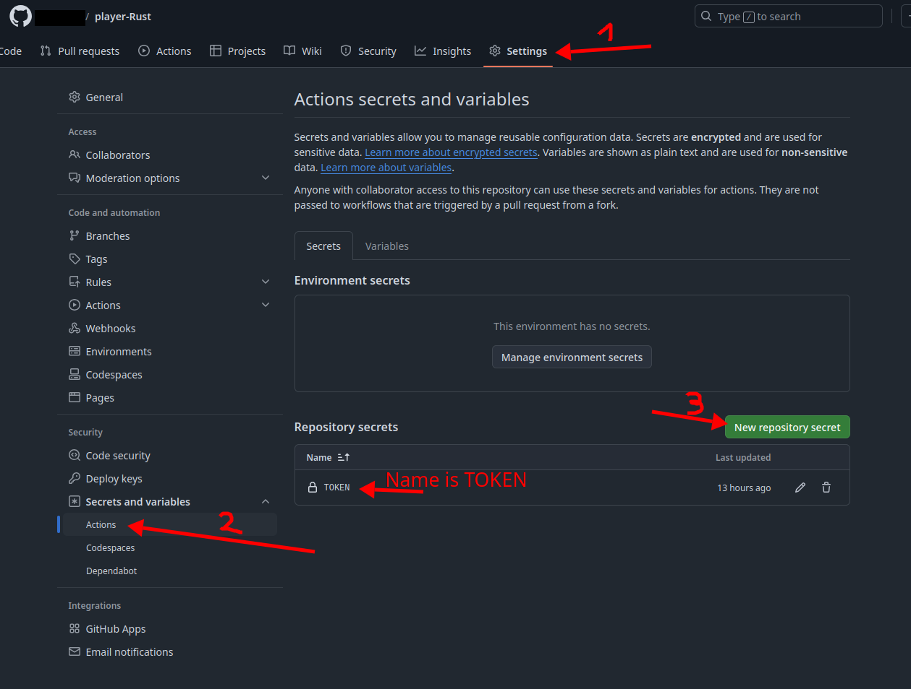
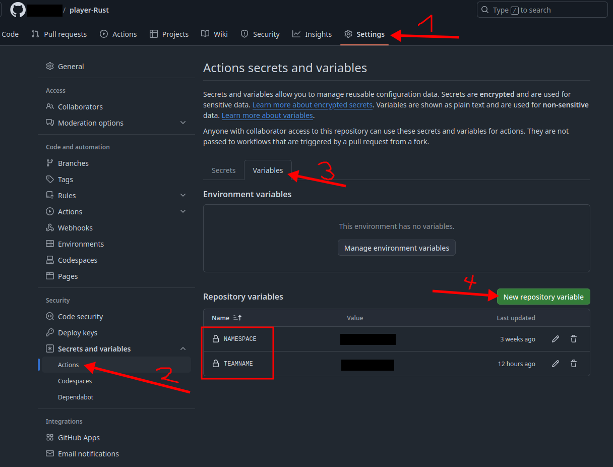

# GitHub CI/CD

Quick instructions where to enter your token, team name, and namespace.

Go to your fork of the Bitwars player.
If you haven't created a fork, go to the [Continuous Bitwars page](https://github.com/Continuous-BitWars/),
select the player in your programming language and click _Fork_ in the top right corner.

The token is a GitHub Action secret.
Open the repository of your forked player and create a new repository secret.
**Paste the whole file you got from us into the value field of the `TOKEN`.**

The team name and namespace are repository variables.
You need to create

* `TEAMNAME` and
* `NAMESPACE`

